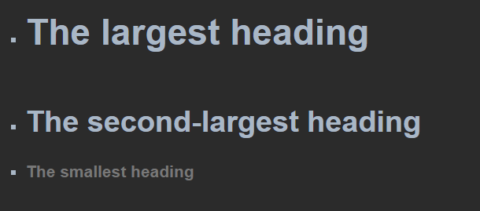
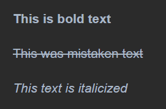

- Headings
  - To create a heading, add one to six # symbols before your heading text.
  - The number of # you use will determine the size of the heading.
  - Example:
    - `# The largest heading`
    - `## The second-largest heading`
    - `###### The smallest heading`
    
  

- Styling Texts
  - Bold
      - use ** ** or __ __
      - shortcuts:
          - Command+B (Mac) or Ctrl+B (Windows/Linux)
          - Example:
              - `**This is bold text**`
              
  - Strikethrough
      - use ~~ ~~
      - shortcuts:
          - Command+I (Mac) or Ctrl+I (Windows/Linux)
          - Example:
              - `~~This was mistaken text~~`
  - Italic
      - use * * or _ _
      - shortcuts:
          - Command+I (Mac) or Ctrl+I (Windows/Linux)
          - Example:
              - `*This text is italicized*`
  
